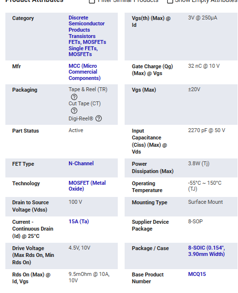
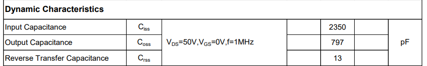
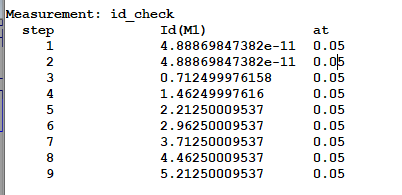
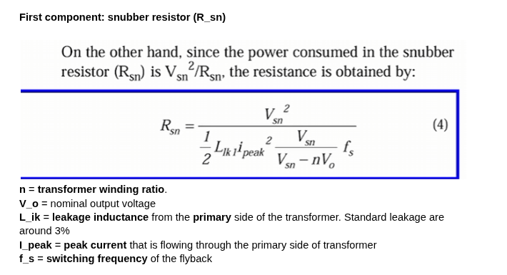
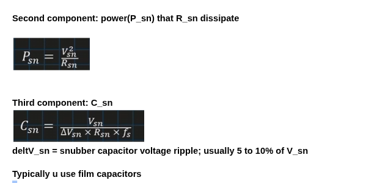
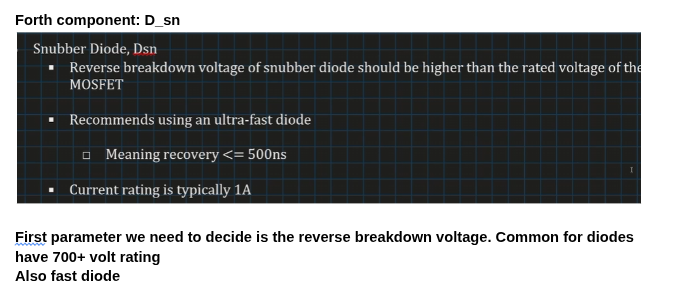
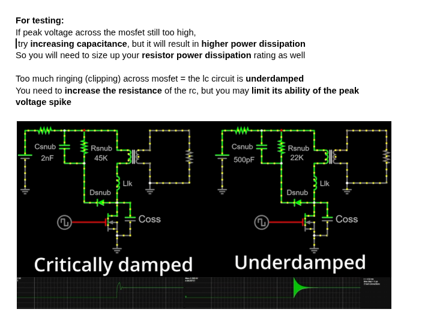
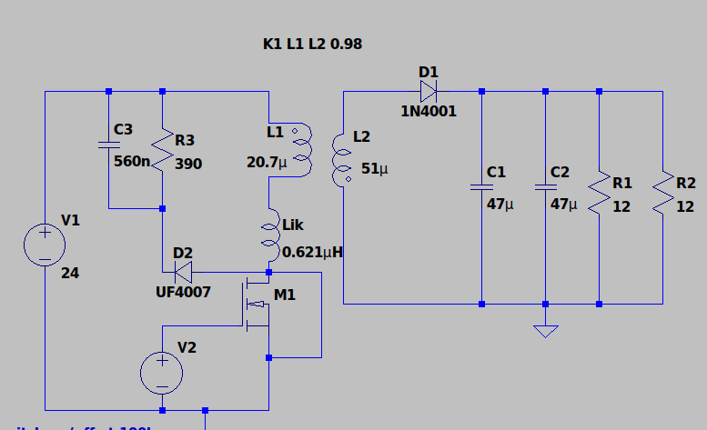
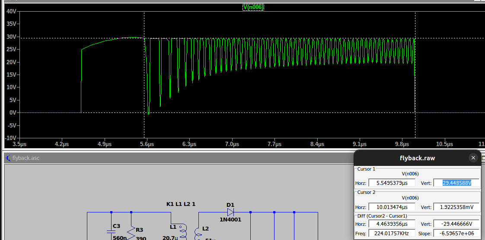

# Prototype → Final Design: Transfer Summary

## Transferable as-is

| Item | Value | Notes |
|---|---|---|
| Output spec | 12V / 2A / 24W | Unchanged in final design |
| Switching frequency | 100 kHz | Unchanged |
| Efficiency target | 85% | Unchanged |
| Regulation target | ±5% | Unchanged |
| Rectifier diode class | Schottky | Same class applies (exact part TBD on final Vin) |
| Feedback topology | TL431 + optocoupler → COMP pin | Reusable once designed |
| MOSFET model (SPICE) | `.model MCQ15N10YA VDMOS(Vto=3 Kp=15 Cgdmax=13p Cgs=2337p Cjo=784p Is=1e-10)` | Validated against datasheet (9.59mΩ sim vs 9.5mΩ spec) — reusable if same part is used in final design |
| Snubber diode model | UF4007, `BV=1000 TT=185n IKF=.15 N=2 IS=100n RS=.03` | Reusable if same part is used |
| Snubber derivation method | Rsn → Psn → Csn → Dsn (4-step formula chain) | Method only — values below must be recalculated |

## Requires recalculation — new values needed

| Item | Prototype value | Final design driver |
|---|---|---|
| Input | 24 VDC | 90-264VAC → rectified bus ≈127-373VDC |
| Turns ratio (N) | 1.57 | Recompute from new Vin range |
| Primary inductance (Lp) | 20.7µH | Recompute from new Vin, D, Ipk |
| Peak primary current (Ipk) | 5.2A | Recompute from new D |
| MOSFET Vds rating | 100V (MCQ15N10YA) | Need ~600-800V class part |
| Leakage inductance (Llk, 3% est.) | 0.621µH | Rescale to new Lp |
| Snubber clamp voltage (Vsn) | 30V | Recompute vs. new reflected voltage |
| Rsn / Csn | 390Ω / 560nF | Recompute from new Vsn, Llk, Ipk |
| Snubber diode voltage rating | UF4007 (1000V, already ample) | Reverify margin against new bus voltage |
| Input stage | 24V bench supply | Bridge rectifier + bulk cap + inrush limiting (new subsystem) |
| Isolation | Simulation-only (ground node separation) | Real creepage/clearance + safety-rated transformer |

## Not yet complete in either version

- Feedback/compensation loop — not designed
- Closed-loop efficiency/regulation validation — `.meas` plan defined, not run

---

## Appendix: Supporting Evidence

Images below are stored in the `supporting-images/` folder alongside this report — keep them together for the links to resolve.

**MOSFET selection (MCQ15N10YA-TP):**

**Snubber derivation (4-formula method):**

**Final validated result:**

**Supporting file:** `flyback.asc` — the validated LTspice schematic (switch, snubber, rectification, transformer with explicit leakage inductance).
